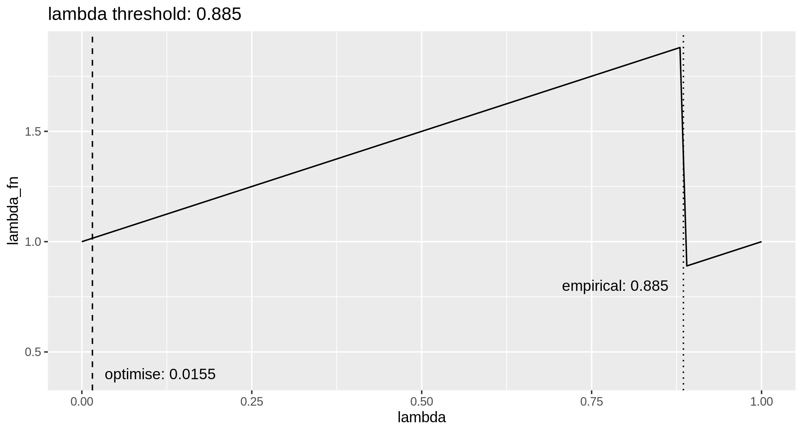

```{r setup, include=FALSE}
knitr::opts_chunk$set(echo = FALSE)
```

I'm exhausted by the argument there's a level playing field, and that I'm poorly behaved. 

It's starting to beggar belief. 

Maybe it's that there are a completely different set of rules for me. And there is an expectation I am perfect, no matter how rude or dehuamanising people are. 

This isn't a special or unique experience; but it sure as hell isn't scientific. 

***

If we're going to address bias in science, we've got to start with the biases of scientists.  

***

It's super irritating for me, yes. It's **super** irritating, mostly the time I have wasted by people who are not truthful and who hold themselves as more equal than me. 

> "All animals are equal, but some animals are more equal than others." [Animal Farm](https://en.wikipedia.org/wiki/Animal_Farm)

But $a \neq b$ does not imply $a < b$ for people, $a$ and $b$. Most of the time, this is a conditional statement. Perhaps $c | a < c | b$ where $c$ is a task that $b$ is better at than $a$, so the output is better. But, for a different task, $d$, we might have $d | b < d | a$, if person $a$ excelled at task $d$. Sometimes people solve things differently, $a|c\, ||\, b|c$ in order-algebraic conditional-statistics unholy mashup parlance. 

But what is irritating me also raises some questions about how we practice science. And maybe this is what bothers me most of all. 

## how not to science

So, I was asked to nominate an ally last year to introduce me at a conference. I nominated a new friend who'd helped a little with a technical aspect of the workshop I was presenting. Let's call him Dick. 

<blockquote class="twitter-tweet"><p lang="en" dir="ltr">For the life of me I can&#39;t believe I need to explain this, but apparently I do. <br><br>Let&#39;s have a chat about civility, shall we? <br><br>**I don&#39;t work with dickheads.** <br><br>I work with people who treat others with basic respect. <br><br>Let&#39;s unpack being a dickhead, shall we? <br><br>1/n <a href="https://t.co/f6HxvLGErr">pic.twitter.com/f6HxvLGErr</a></p>&mdash; Cap&#39;n Blackheart Bette (@cantabile) <a href="https://twitter.com/cantabile/status/1170023891298701312?ref_src=twsrc%5Etfw">September 6, 2019</a></blockquote> <script async src="https://platform.twitter.com/widgets.js" charset="utf-8"></script>

### Dick's anxiety

Dick was very nervous about the introduction. He requested reassurance several times, including the day of the workshop. Meanwhile, I'm thinking I've never been to this before, you seem a lot more experienced, and I'm doing three hours, you five minutes? 

But hey, I do get it, I'm empathetic. And I appreciate that having worked for a decade as a professional pianist, I now have a certain amount of stage experience. Having trained others in performance, I know it's a developed skill; I also remember how bad I was at the start. 

So I was happy to reassure Dick. 

He approached me before and after the workshop on the day, and once again, I provided reassurance. He didn't seem very interested in my workshop, which surprised me, as I thought we had a shared interest in pedagogy. 

But Dick never did seek to engage me. Upon reflection, a real flag was that the entirity of his friendship comprised him _helping_ me; which of course gives him an opportunity to peacock his coding skills. 

I don't believe he was ever a genuine friend now. I call these people performative allies. And they are the worst time wasters. 

I got this impression from the way he handled my problem. 

### my anxiety

I approached Dick in considerable distress about my research. The details aren't relevant, as toxic academia is so common, we can fill in the blanks. 

I wanted to know if I could follow him around at a conference to avoid anxiety-inducing confrontation with a poorly behaved co-author. That I thought I could salvage the working relationship, and the research with a bit of emotional support.  

To cut a long story and a lot of frustrating, time wasting pain. Dick's reaction wasn't one of empathy at any point. I was not afforded any agency, and nothing was explained.

Dick decided, despite not knowing the whole story, indeed not finishing the conversation, that I was irrational. From at least this point he ceased being truthful. 

I ended up with a lot less friend, and no explanation. Just a lot of ghosting. When we did talk about it, he said I was making good points; I don't believe he is capable of understanding his own behaviour because of a pathalogical inability to admit wrongdoing. 

***

Just imagine if I had been as scathing of his public-speaking anxiety, a small problem, as he was of my research issue, a big problem.

***

But the thing about dickheads, is they expect other people to find easy what they find easy, say coding, but expect others to accommodate what they find hard. Only their values matter. 

It's an infuriatingly narcissistic stance; and it's inherently not scientific. 

I'm not like Dick. I actively *try* to admit wrongdoing. To learn to take responsibility, like the adult I am. And I think this is much better for science.

### what about science?

There's a lot to be learnt in how not to science in Dick's defensiveness. 

Let's replace *unnacceptably upset* with *lacking the required knowledge*.

Let's consider that the Dicks of this world currently control research software engineering. And I don't think we're going to figure out how to science until we purge this *Dicks are more equal than others* assumption.

## how to science

I was contacted by one of my collaborators, we'll call her Charlotte, a couple of days ago. 

We had a great exchange. I think this is the way to science. I'll include the dickhead options I didn't choose. 

Charlotte is a tenured social scientist, I am doing a doctorate in statistical computing. She is several levels above me in academic stature. 

**Charlotte:** you know that equation you coded up in an R package? I'm trying to finish the manuscript and it doesn't knit, and what's making it not knit is the function you worked on. 

**Me:** Yup, sure, I'm fairly certain the answer is in a vis I left for myself in the readme. 

`Dickhead option:` Ugh. I can't believe you're wasting my time with this. It's right there on the repo.


```{r fig.cap="The dotted line gives the output of the `optimise` approach, which doesn't work. The current function takes a more empirical approach, as it were. Since the $\\lambda$ function always has this shape, we can subdivide the interval between 0 and 1 and approximate the point, to a certain degree of precision (the dotted line)."}

```

Me, to self. *Ah, so there was an issue with finding local minima in the base integration function I implemented. This visualisation reminds me of that but is of no use to Charlotte. It's got absolutely nothing to do with her paper. Also me, to self. What simple and easy tweaks will I do next time to be more informative for my collaborators? Face palms, really needed the shortest vignette.* 

**Me:** I left myself enough info in the readme. I think the function you're after is `lambda_inf`. 

`Dickhead option:` Look at the R file, it's all there.

**Charlotte:** Nope still not knitting. 

`Dickhead option:` It's probably your code.

**Me:** Let's see if I left any documentation. W00t, yes. 

`Dickhead option:` Ugh, the documentation is right there. Just `?lambda_inf`.

Me, to self: *This documentation from January Charles is excellent work! We should be able to solve this now.*

**Charlotte:** I think I can solve this now. Cheers! ... It knits! Yay. 

**Me:** Great. Can we talk about *my* current paper and you shower me with much needed praise? 

**Charlotte:** Sure! *Reads paper and showers Charles with praise.*

`Dickhead option:` No, I got what I need and you are not important. Bye! 

Me, to self: *Thank goodness I've got someone with whom I can develop trust to not be a dickhead when talking about thesis.*

There was ample opportunity for me to choose a `dickhead option`. I could assume Charlotte is an idiot because she doesn't have my education in mathematics or code. No, she was off becoming a tenured academic social scientist.

Similarly, she could heap derision on me for not knowing literally anything but what goes into the calculation for one number in the *entire paper*. But she knows I have several manuscripts on fire on my desk right now. 

What I valued in this project is totally different to what Charlotte valued. That's *totally fine*. It's good. I'm intrigued by statistical computing questions. Charlotte has a paper, with a research question and everything. In. Um. Something something. Green energy maybe. I'm also doing a thing on mung beans next. I've been referencing biomedical research and palaeontology this week. But I almost instantly translate problems into just coding or math, you know, the fun stuff. 

What would be the `dickhead option`, however, would be to make this interaction about my needs, interests, and values. This logic leads precisely to posturing when science needs to be done. The focus is shifted from solving a problem to a hill-dying on Dick's values.

For the life of me, I cannot fathom how Dick can do effective science if the only things that are valued are precisely Dick's values. 

I'm stoked that Charlotte and I chose to do science together; we have such different skill sets. What fun we could have solving puzzles together.  
