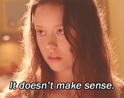

```{r setup, include=FALSE}
knitr::opts_chunk$set(echo = FALSE)
```

## anger is an unpalatable disability

If only we lived in a perfect world. Where everyone had a happy childhood. Where everyone had enough to eat, a roof over their heads, and warmth in all respects. 

For those of us who didn’t have those things, controlling emotions can be extremely difficult. That’s love _and_ anger. I'm a raw nerve. For me, it’s also creativity and productivity; tempered with depression and sedentism. Would that I were otherwise, I experience emotions in extremes.  

Think of it as a mental aberration. It’s as much an advantage as it’s a disability. 

I think expecting me to have to full control of my emotions **no matter how much time and energy I lose explaining that having my wishes disregarded in favour of harmful and condescending *help* is more harmful than no help at all** is holding me to some pretty stark double standards, but this not for me to decide. It is for me to accept; knowing I cannot achieve this level of perfection, as always I must choose exile. 

## no unsolicited help, solid

I ask for help, I do. All the time. I have to, for research. I can't do a whole doctorate in mathematical science on my own. 

It's usually explicit. *How do I randomly generate data that mimic sample sizes in meta-analyses?* Not everyone has the expertise to answer my questions, and an early lesson was recognising those who didn't know how to say they didn't know.

I have a really good grip on my triggers. I find these can now be completely avoided when the person I interact with is relatively considerate; and I endeavour to be a pleasure to work with, myself. 

When the person I approach listens to what I need, provides that, and doesn't presume to intervene in other ways, I believe it's gone swimmingly. I have made many friends this way, many of whom come to me for help in return.

## unsolicited help, not solid

But where, I believe, the wheels come off the wagon, for me, is when people take it upon themselves to manage me, often disingenuously, to do something they argue will be more beneficial for me. 

This is not cleverly managing me; it's just pissing me off. 

Honestly, I think it pisses everyone off; but they don't have as much trouble handling their emotions as I do. Or maybe I see it more often because I'm pretty clever? Anyway, I think anyone that sees it happening to them experiences the proverbial rage when it's coming from someone in a position of power.

Often the help that is provided is in direct contradiction to the help I requested. And is frequently in line with what I've described as harmful. 

Almost all unsolicited help and advice has been on a spectrum of not useful to offensive. 

## exasperating

At this point I meet the usual suspects:

- it's a hard time for them
- "things get missed", "it slipped through the cracks"
- it wouldn't be beneficial anyway, for me, but what they were trying to do would be 
- they didn't think it would upset me
- it wouldn't upset them
- they are a good person! 
- they meant well

And the crowning beauty:

- was trying to teach you `life_lesson`

I have an excellent memory; I remember they said they understood the difference between harm and help. That they could accommodate my wishes. At this point, I begin to question if anything I said was heard; they do not seem to understand I have already explained this behaviour is harmful. 

And they are now indignant I am not more grateful for their help. How would you feel? Wouldn't you feel a bit exasperated? 

## the infinite loop of harmful help 

My ability to control my emotions is inversely proportionate to the number repetitions of this pattern I am experiencing: 

1. Someone offers to help. 
2. I define what would help and what would harm.
3. Crucially, they tell me they understand; I trust them.
4. They do the harm I describe, and claim it is for my benefit. Sometimes they replace help with this harm, sometimes it's both.
5. They argue I am irrational when I bring up the definition of harm. *I'm irrational?*
6. They choose a subset of the justifications from the usual suspects listed above. *I'm irrational?*
7. I am forced to explain again how harmful this is. 
8. Repeat from step 3. *I'm irrational?*




This is an infinite loop of harmful help, driven by the principle of magical intent  [@mcewan_harmful_2011], whereby the person believes good intentions mitigates all harm, and misplaced superiority. This is nonsense; this is irrational. If I accidentally run over your cat, doesn't make it not dead, and doesn't reduce your grief. And I don't require you to determine what is to my benefit; and will not appreciate it being up for debate.  

Once I have invited help, if the other person assumes they know better and can disregard my wishes, it seems the only way to kill the loop is to withdraw from that person entirely.

## harm is proportionate to time and energy expended

The more repetitions of the loop I endure, the more my ability to control my emotions begins to fray. Returning back to what feels like the start each time. *I was just trying to help.*

**Harm is worse than no help**. Because if you harm me repeatedly, ignore my requests, I may not be able to control my emotions, and that’s **not safe for you**. 

I’ve had decades of therapy, I learnt to articulate myself well. But you can't cure the life I've lived, my complex post-traumatic stress disorder, by finding it unpalatable. 

I know what will trigger the hell out of me and warn people well in advance. And I know what I need for myself. I’m an experienced teacher. Usually what I need is reassurance, and sometimes some academic guidance. Also, company, because it’s nice to turn ideas over with intellectuals.
 
# it's not a disability, it's difference 

I have made a [life’s work](https://lifes-work.netlify.com/) out of balancing my creativity with the time I require to recharge. Mathematical science provides me with both. It also provides me with a calm from the emotional storm the world brings me. 

# when it becomes exploitation

Explaining to someone how they’re hurting me doesn’t benefit me; it doesn't mitigate the harm already done. And it doesn't return the time or energy I've expended, nor how that expenditure affects my research. 

Indeed, the explanation itself is demeaning, harmful, and emotionally exhausting for me. 

When someone recoils from me for losing my temper after subjecting me to the infinite loop of harmful help, I end up surveying the help that was given and thinking:

- This person doesn't appear to have ever liked me
- The amount of time and energy I expended on explaining how they were hurting me vastly outweigh the paucity of friendship offered
- I would have been better off never accepting help from this person
- This person doesn't listen to me.
- This person thinks it's okay to be disingenuous with me
- This person is not considering my well being
- This person is not prioritising the help requested, but their own, unspecified, agenda. 

And, finally, *they're* offended after two minutes?! 

## here's what I'm going to do

I'm going to flag I experience extreme emotions more explicitly moving forward; and that it includes anger. And I'm going to flag unsolicited help as a clear trigger. I will be far more explicit about this.  

But I can't promise I can hold it together when subjected to the infinite loop of harmful help. Any community that requires that is not a safe space for me or them. I will disengage from people with those values. I'm not trying to pick a fight; I simply live in reality, I am not perfect.

And I, for one, think others are lesser for it. Because the insight and empathy this life has gifted me is, I think, useful for science. 

I think it diminishes you to see this as diminishing me, rather than my principal components of personality, flaws included, have [a different basis set](https://softloud.github.io/onetimetrophybitch/about.html) than yours do. 

Anyone perpetuating the infinite loop of harmful help has, after all, some things to work on themselves.    

## dos and don'ts

Do help with what has been asked for. Do listen. Do give the benefit of the doubt.  

Don't redefine what is helpful and try to enforce that on the person asking for help. That will begin the infinite loop of harmful help; it is not helping, it's harming. And it easily slips into emotional abuse and character assassintion.  

Don't help anyone unsolicited. Don't give people advice. The chances of you harming greatly outweigh the chances of you helping. 

Do not diagnose others as irrational while doubling down on irrationality yourself; you'll come off as hypocritical and infuriate the target. Don't diagnose others, period. 

It is unlikely you know better than anyone else what is of benefit for them. You know what's best for you, after all. Don't impose your values on others, they may care about wildly different things. For example, if one wants  to achieve stability as soon as possible, industry might be more appealing than scholarship.  

Do be honest with yourself. If someone asks you to accommodate something. Especially something trivial; something that wouldn't bother you. Especially something they say is important. If you can't accommodate it, simply say so. Don't ask them to take responsibility for your inability to admit this shortcoming to yourself. 

Apologise and take responsibility, no matter how good your intentions are. Everyone's intentions are always good. 

Above all, do not perpetuate the infinite loop of harmful help. Sometimes doing nothing is better. The cardinality of potential harm is far greater than that of any help that might be provided. Harm is worse than no help. If you cannot avoid the loop, don't help.  

Do recognise harmful communication driven by magical intent[@mcewan_harmful_2011] as emotional abuse. Recognise we've all been guilty of it, and should guard against it. Everyone has abused others; telling yourself you haven't is a fairytale. You have hurt, and you will again. But let's try not to, eh? 

Do be happy for me that I'm living the very best life I can, doing what I love. Do be happy that my triggers are under control when I'm listened to, that's a big achievement, I can pass for normal in most situations. I have only lived openly as a survivor of trauma for a couple of years, and I ran my own business for twenty years, I completed three degrees, two theses. I never took special consideration, until recently I rarely missed a deadline. No one ever knew; that means my triggers are getting sparse.

I didn't get triggered because I expected to be offended all the time in those worlds, spoken down to. I was braced. I didn't lose my temper often, but there were plenty who disliked me; I often feel unlikeable. 

Now I am missing deadlines all the time, and I am struggling  to focus on my work. My trigger right now is from a cognitive dissonance with people I expect better from. I didn't expect them to have the solution; I expected them to assist me in the solution I already had figured out. I did not expect them to be disingenuous about listening to the problem and saying they understood and could help. I am writing this because, to finish my doctorate, I need the loops to stop. If you deem me to be irrational and think you know better, don't help! I'll get by just fine, I promise.

I actually think it's all kind of sweet. As if wishing really hard that terrible things didn't happen to me will make the consequences of those events disappear in fairy dust. I think people start out wanting things to be better; but it's almost comical, if it wasn't so damaging, how far they can wander from their objective. 


***

**PSA Don't pull the infinite loop of harmful help on me. At this point, it has happened too many times in quick succession and I cannot control my negative reactions.** 

I would really like to see what kind of person I could be with financial and housing security, and not trapped in infinite loops of harmful help. Who knows? She might not have trouble controlling her anger at all. 