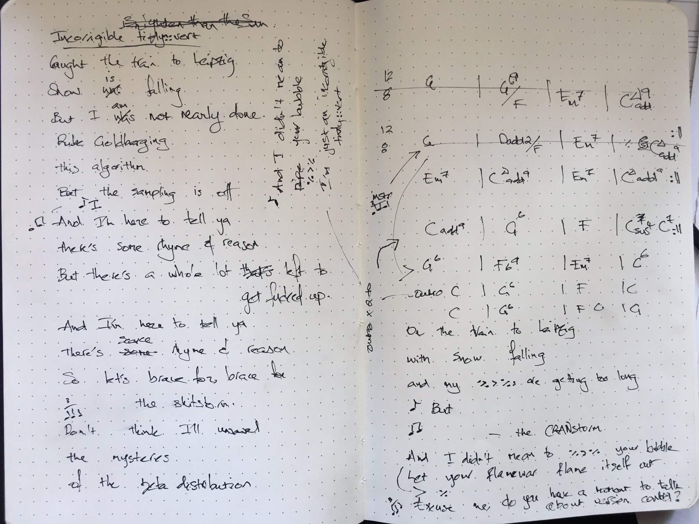

```{r setup, include=FALSE}
knitr::opts_chunk$set(echo = TRUE)
```

## incorrigible tidy::vert  `%>%  exegesis()`

> This post will be adapted for inclusion in a joint publication of mathematically-informed artworks engaging with Magritte's pipe, an icon of surrealism. This forthcoming publication is from a working group of researchers who met at the 2019 [Heidelberg Laureate Forum](https://www.heidelberg-laureate-forum.org/).

In his 1929 surrealist painting, _The Treachery of Images_, René Magritte declares  _Ceci n'est pas une pipe_ (_This is not a pipe_). In so doing, he highlights this is but an _image_, a representation, of a pipe, not truly a pipe itself. 


<center>

](magritte-pipe.jpg){width=50%}

</center>

I recently wrote a song with lots of references to R and the `tidyverse::` metapackage[@wickham_tidyverse_2017].   


```{}
I didn't mean to %>% your bubble
I'm just an incorrigible tidy::vert
```


In this post, I'll unpack the [_pipe_](https://magrittr.tidyverse.org/) operator, ` %>% `, that features throughout the lyrics.  


## the ` %>% ` operator in the R language

```{r echo=FALSE,fig.cap="[Image source: `magritrr::` GitHub repository.](https://github.com/tidyverse/magrittr/blob/master/man/figures/logo.png?raw=true)", fig.align='center'}

knitr::include_graphics("pipe-logo.png")

```

The ` %>% ` pipe operator is the first major concept introduced in the programming section, following exploratory data analysis and data wrangling, of Wickham's _R for Data Science_ [@grolemund_r_2017].

With Stefan Milton Bache's  `magrittr::`[@bache_magrittr_2014] package, 

```{r, echo=TRUE}
# f(x) is equivalent to x %>% f()
library(magrittr)

round(3.1)

# is equivalent to

3.1 %>% round()

```


### What is an operator?

We often forget that operators are, themselves, functions. 

For example, $+$ is a function that takes _two_ arguments, numbers, and returns a _single_ number. Algebraically, 3 + 2 = 5 is shorthand for +(3, 2) = 5. 

For those with formal mathematical trianing, multiple uses of the ` %>% ` operator in a single line of code can be thought of in terms of a coding instantiation of a _composite of functions_.

### What is a composite?

Let $f$ and $g$ be real functions. 

The _composite_ of $f$ with $g$ is the real function $g \circ f$ given by the formula $(g \circ f)(x) := g(f(x))$.


Here is an example of three functions: $(h \circ g \circ f)(x) := h(g(f(x))).$


```{r }

# a (nonsense) composite of R functions 

set.seed(39)

# get a random sample size between 20 & 100
sample(seq(20, 100), 1) %>% 
  # generate sample from normal distribution
rnorm(., 50, 0.5) %>%
  # calculate mean of that sample
  mean() 

```

To see how this is the $(h \circ g \circ f)(x)$ instantiation, we take a look at the $h(g(f(x)))$ instantiation of the same code. 


```{r }

# this line of code is equivalent 
mean(rnorm(sample(seq(20, 100), 1), 50, 0.5))


```

It is harder to read the symbols so close together, in this $h(g(f(x)))$ instantiation. Also, arguably more importantly, one does not have the ability to comment each component of the algorithm. 

There is a downside to the ` %>% `, however. The longer a composite becomes, the more difficult it is to identify errors. 

```{eval=FALSE}
 
On the the train Leipzig with snow falling
And my %>%s are getting too long

```


## incorrigible tidy::vert  `%>%  lyrics()`

```{r echo=FALSE}
 


```


```
Caught the train to Leipzig, snow is falling
But I am not nearly done
Rube Goldberging this algorithm
But the sampling is off.

I didn't mean to %>% your bubble
I'm just an incorrible tidy::vert

And I'm here to tell ya
There's some rhyme and reason
But there's a whole lot that can get fucked up

And I'm here to tell ya
There's scarce rhyme and reason
So let's brace for the shitstorm

Don't think I'll unravel
The mysteries of the beta distribution
On the the train Leipzig with snow falling
And my %>%s are getting too long

But I didn't mean to %>% your bubble
I'm just an incorrible tidy::vert

And I'm here to tell ya
There's some rhyme and reason
But there's a whole lot that can get fucked up

And I'm here to tell ya
There's scarce rhyme and reason
So let's brace for the CRANstorm

And I didn't mean to %>% your bubble
Let your flame war flame itself out
And I didn't mean to %>% your bubble
Excuse Me, Do You Have a Moment to Talk About Version Control?

And I didn't mean to %>% your bubble
I'm just an incorrible tidy::vert
And I didn't mean to %>% your bubble
I'm just an incorrible tidy::vert


```

## iphone balanced on music stand quality recording

Don't say I didn't warn you about the sound quality.


<iframe width="560" height="315" src="https://www.youtube.com/embed/dDRBrmth2YI" frameborder="0" allow="accelerometer; autoplay; encrypted-media; gyroscope; picture-in-picture" allowfullscreen></iframe>
