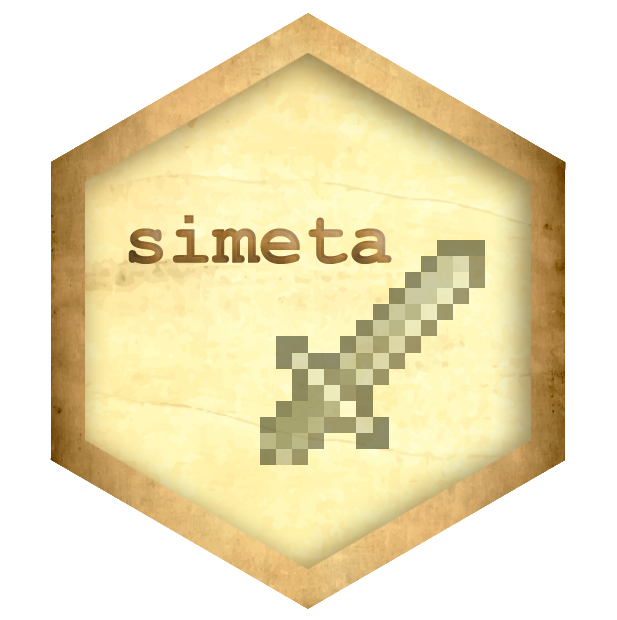
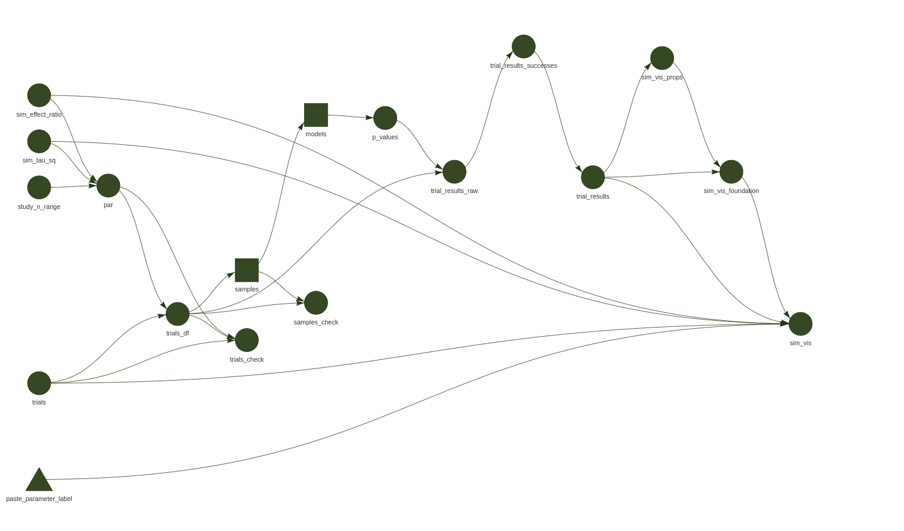

--- 
title: "Explaining research code using reproducibility tools" 
description: |
    Simulating meta-analysis data in R with simeta and celebrating a rare moment of avoiding the quagmire of feature creep, the anxiety of past doctoral work, and using data science tools to explain a complex algorithm to a bunch of scientists who have better things to do than go through every line of my code.
author: 
   - name: Charles T. Gray 
     url: https://softloud.github.io/onetimetrophybitch/about.html 
date: 2023-03-30
output: 
    distill::distill_article: 
        self_contained: false
        # code_folding: show 
        toc: true
categories: 
    - simulation
    - vis
    - meta-analysis
    - pipeline
    - reproducibility
    - engineering
---


```{r }
# pkgs used in this post
library(knitr)
library(readr)
```


## [`simeta`](https://softloud.github.io/simeta/)

Finally a hex-worthy use of code I wrote for my doctoral project! 

```{r fig.align='center', fig.cap="[Package site](https://softloud.github.io/simeta/). Thank you, [Sarah Romanes](), for package name awesomeness, and mange tak, [@anatomecha](https://github.com/anatomecha/) for the sweet hex.", echo=FALSE}


```

And, by *hex-worthy*, I mean some other people have use for it. And by *some other people*, I mean three collaborators, and perhaps some of their collaborators. 

In my world that is *a lot of scientists*; a hex-worthy number of scientists!  

## what this post is about

Using `simeta` for a new project helped me steer past the houses of cards my ever-empretzled doctoral simulation functions had become. Instead of devolving into paralysed state of anxiousness, obsessing about unit tests failing because the test is old not because the code is bad, and knowing I had a very small group of people I need to communicate my results with, I found I was able to shrug off what had held me back from using this code before, and simply get some science done.  

Over my years of writing simulation pipelines, explaining what one point in a visualisation, that is, what the extracted and summarised result of one trial continues to be the challenge I ruminate on. 

```{r sim, fig.cap="New simulation study using simeta functions developed for my doctoral project. Even when drafting a visualisation, I try to hold myself to the rule of finishing the sentence *Each point represents...* as it helps me keep track of what the visualisation is truly answering.", layout="l-page", fig.height=6, echo=FALSE}

read_rds("example_plot.rds")

```

The key lesson I'm taking away from this new version of `simeta` was in fixing in my mind what my collaborators will use this for. It is technically a software package, but my goal is not to create the greatest software, nor to produce the perfect analysis. It's to give them interoperable code they can use or rely on for their new analysis.  

In fact, truth be told, reproducibility also takes a back seat, to documentation. **How often do my collaborators really run my code?** Instead, collaborators tend to want to fiddle with the parameters and structure of my pipeline, such as sampling distributions or models fit, and I do the dirty work of finding the right line of code to change. 

In any case, if the simulation study misses the point of their question, which can easily happen when juggling so many parameters, and only having had one preliminary meeting, there's no point spending all day perfecting the software, tests, and reproducibility. 

There is no point to demanding workflows of myself and others that will breakdown and we resort to emailing scripts. Instead, I find myself increasingly focussed on using software development and datascience tools to **explain** the code and explore what might save my collaborators time not just on this project, but in future.  
For example, explaining the many components of a simulation that are aggregated in a visualisation generated from a make-file, so that my collaborators can incorporate the results of my code into their project. 

```{r pipeline,fig.cap="It's useful to combine the simulation and visualisation pipeline. This is the pipeline that produced the simulation results visualised above.", layout="l-screen", echo=FALSE}



```

## the reproducibility stuff

First thing I did was try to make sure my collaborators have a hope of running my code by a doing a bunch of reproducibility stuff, such as:

- Archived esotoric doctoral code and pared down to functions that were useful to my doctoral work *and* useful to these collaborators (a *non-empty* intersection, so motivating to think of others using my code)
- Removed some truly fruity dependencies, and tried to make the package only dependent on standard packages I know my collaborators use, such as `tidyverse`
- Wrote the [simulation study make file pipeline](https://github.com/softloud/simeta/blob/master/_targets.R) shown in Figure \@ref(fig:pipeline), visualised in Figure \@ref(fig:sim) my first try at understanding their problem 
- Tidied up the function documentation and created a quick summary in the [readme](https://softloud.github.io/simeta/) of the simulation

### reproducibility is not enough

Reproducibility is all well and good, I'm quite pleased with my progress there. To be honest, there's plenty more to do. Instead of debugging the existing tests, which were extensive, just for starters.

Reproducibility and good enough computational science can be a sinkhole of time, and what bothers me is that even if I tick all those boxes, I don't feel as if the package is ready to be *shipped*. 

## the struggle is real

<div class="tenor-gif-embed" data-postid="13995468" data-share-method="host" data-aspect-ratio="2.38095" data-width="100%"><a href="https://tenor.com/view/horse-come-on-lets-go-never-ending-story-gif-13995468">Horse Come On GIF</a>from <a href="https://tenor.com/search/horse-gifs">Horse GIFs</a></div> <script type="text/javascript" async src="https://tenor.com/embed.js"></script>

I have fallen prey to the sinkhole of despair, caught in a quagmire between good enough data science practice, inevitable feature creep, and documentation becoming such a daunting task. It is ever a challenge to clearly communicate what one trial in one simulation is to my collaborators, and how this was computationally achieved.

Indeed, I intended this post to be a picture-book visual walkthrough of the simulation pipeline, to show you, dear reader. The [readme](https://softloud.github.io/simeta/) has my current attempt, but it is no where near the picture-book walkthrough I'm aiming for.  

With the goal of pushing before Copenhagen's PyData this evening, I'm leaving the picture book for another day. Here are some of the challenges that prevented me from finding an optimal path to fully explaining my package.  

### Verbal challenges

I try to to complete the phrase *Each point represents...* in each simulation visualisation I create, but it is easy for it the sentence become a combinatorially complicated, overburdened mash of *for a given*, *for each*, and *with respect to* clauses. 

### Visual challenges

Simulation parameters easily get out of hand. There are only so many levels that look for colour, less for shape. There are also only so many categorical variables that can be encoded total. 

## Micropacking analysis code 

Although my picturebook walkthrough isn't perfected, I know I've made a better effort to document what is in the simulation pipeline than I have for any previous analysis. 

It once again strikes me how it's easy to narrowly interpret the benefits of reproducibility with respect to scientific trustworthiness. However noble that may be, I tend to find my appreciation for the tools of reproducibility are more in terms of improving accessibility and interoperabiltiy of collaborative computational science. 

For example, by packaging the functions, it was easy to generate examples of the subprocesses of the simulation pipeline in the [readme](https://softloud.github.io/simeta/). And the function is automatically generated by `pkgdown`. My collaborators can then understand easier what toolchain outputs I'm inspecting with them, look at [the documentation](https://softloud.github.io/simeta/reference/index.html), and they can open an issue if there is something they don't understand. The documentation can always updated and improved.   

It's been a good lesson in learning to release and use open source code, getting it to *good enough* reproducibility and accessibility without losing months to pointless computational busywork, particularly appeasing persnickety software development gods. I think a real pitfall for me is finding tools associated with reproducibility very useful for disseminating research code; however, analyses rarely need to be at CRAN levels of robustness, and it's easy to fall into sinkholes of computationally inferior despair. 

What matters is doing my best, within a realistic time frame, to help my collaborators *understand* and rely on my work. Science is always incremental, including code; I improved this codebase because it's needed for a new project. If it's needed again, I'll improve it some more. 


