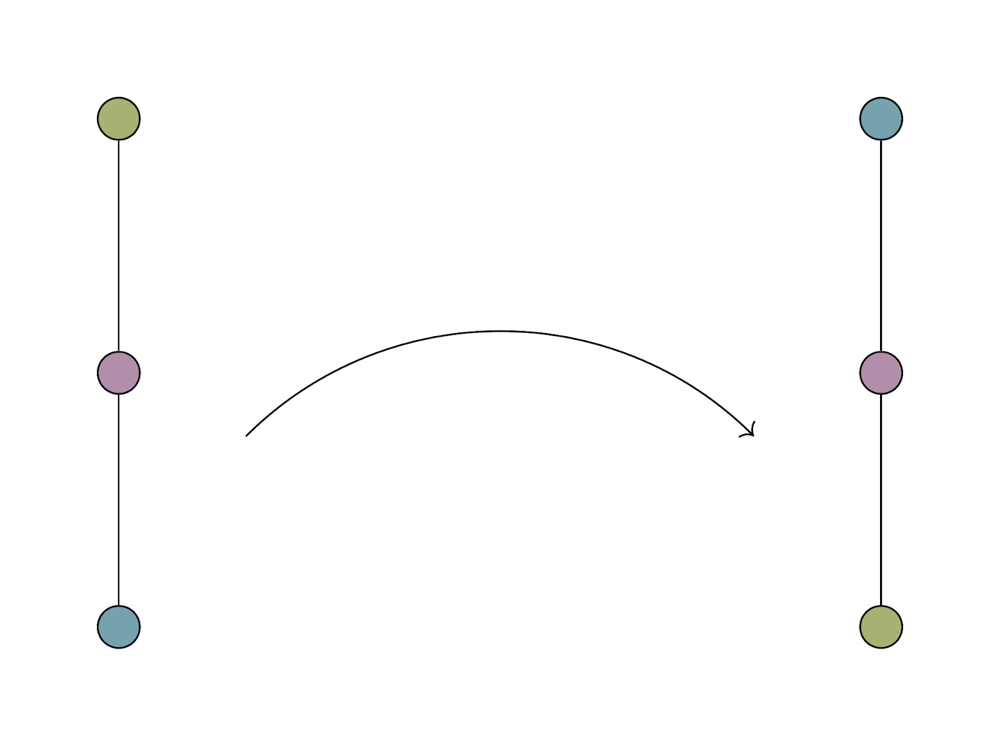
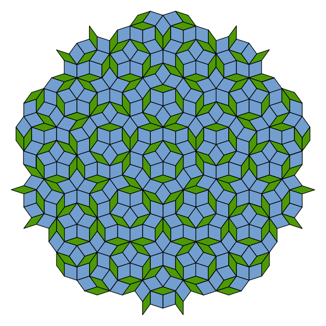

<!-- class: center, middle -->

# "You type so fast it's scary."

---
class: right, middle

# _Music prepared me for mathematics._

---
class: left, middle

# Listening to music is doing algebra.

---
class: middle, center, inverse

## Less than or equal to

# $\leqslant$

---
## $\leqslant$ in music

The first note is a *perfect fifth* **below** the second note.

---
# Define $\leqslant$

Let $P$ be a set.

An *order* on $P$ is a binary relation $\leqslant$ on $P$ such that,
***

for all $x, y, z$ in $P$, we have

- $x \leqslant x$;
- $x \leqslant y$ and $y \leqslant x$ imply $x = y$;
- $x \leqslant y$ and $y \leqslant z$ imply $x \leqslant z$.

***

We then say $\leqslant$ is *reflexive*, *antisymmetric*, and *transitive*, for each of these properties, respectively.

---
class: inverse, middle, center
# ostinati and homomorphisms

---
## homomorphism

A *homomorphism* is a structure-preserving map between two algebraic structures of the same type.

***

For a map $f: A \to B$ between sets $A$ and $B$, we say $f$ preserves an $n$-ary operation $\mu_A$, if, for all $a_1, \dots, a_n$ in $A$, we have 

$$
f(\mu_A(a_1, \dots, a_n)) = \mu_B(f(a_1), 
\dots, f(a_n)).
$$

---
class: right
## order-preserving homomorphism

---
class: right
## order-preserving homomorphism

---
## order-reversing homomorphism

---
class: right
## order-reversing homomorphism

---
## Tessellating homomorphisms

Image source: A penrose tiling from wikipedia.

---
class: inverse

# Shall we do some musical algebra together? 

*Tessellations from Eppalock to Heidelberg* 

by Charles T. Gray

An algorithmic piano work tessellated for the opening of the 2019 Heidelerg Laureate Forum.