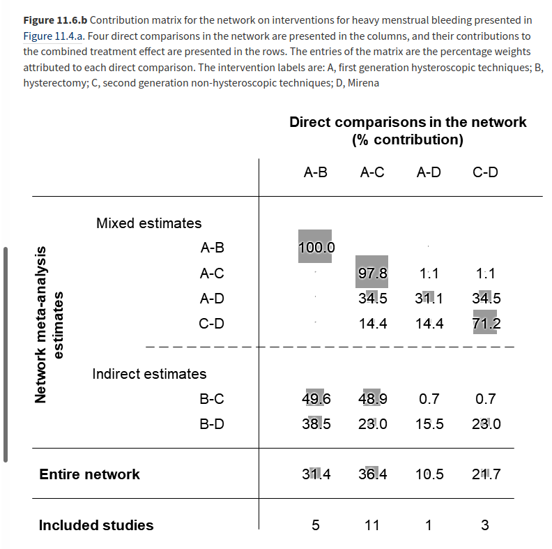

```{r setup, include=FALSE}
knitr::opts_chunk$set(
    echo = FALSE,
    message = FALSE,
    warning = FALSE,
    cache = TRUE,
    fig.align = "center"
    )
```


```{r pkgs}
# toolchain walkthrough
library(multinma) # network meta-analysis
conflicted::conflict_prefer("filter", "dplyr")

# additional packages used in this walkthrough
library(tidyverse) # general purpose
library(kableExtra) # tables
library(patchwork)

set.seed(43)

```

```{r clean data}


parkinsons_dat <- parkinsons %>% 
  mutate(
          studyn = str_c("study_", studyn),
          trtn = str_c("trt_", trtn)
  )


```

## network meta-analysis

```{r network, include = FALSE}

parkinsons_net <-
    set_agd_contrast(
        parkinsons,
        study = studyn,
        trt = trtn,
        y = diff,
        se = se_diff,
        sample_size = n
    )

parkinsons_nma <-
    nma(
        # network object
        parkinsons_net, 
        
        # fixed; for brevity w sensitivity
        trt_effects = "fixed", 
        
        # set prior on treatment contrast with placebo
        prior_trt = normal(scale = 100))


```

```{r network plot}

plot(parkinsons_net, weight_edges = FALSE)


```

example data set `?parkinsons` [@phillippo_multinma_2020]

## way station | a stopping point on a journey

<div class="columns-2">

{width=100%}

- [site with reproducible toolchains](https://softloud.github.io/nmareporting/)
- [open source code repository](https://github.com/softloud/nmareporting)
- [contribution pathways](https://github.com/softloud/nmareporting/blob/master/manuscript/draft/nmarep-ms.pdf)
- [discussion forum](https://github.com/softloud/nmareporting/issues)
</div>

## gaps in the toolchain | Cochrane reporting

```{r contribution matrix}

```

Cochrane Handbook [@higgins2019cochrane]

## extending the toolchain | Sensitivity: how much do the studies agree?

```{r leave m analysis, include=FALSE}
all_trt_comb <-
  parkinsons_dat%>%
  select(studyn, trtn)

trt_comb <- 
all_trt_comb %>%
  pull(studyn) %>%
  unique() %>%
  map_df(
    .f = function(study) {
      all_trt_comb %>%
        filter(studyn == study) %>%
        pull(trtn) %>%
        combn(2) %>%
        t() %>%
        as_tibble()
    }
  ) %>%
  distinct() %>% 
  filter(V1 == 2)

trial <- function(studies_to_include) {
  
  trial_model <-
  parkinsons_dat%>% 
    filter(studyn %in% studies_to_include) %>% 
     set_agd_contrast(
       # data
       .,
        study = studyn,
        trt = trtn,
        y = diff,
        se = se_diff,
        sample_size = n
    ) %>% 
      nma(
        # network object
        .,
        
        # fixed; for brevity w sensitivity
        trt_effects = "fixed", 
        
        # set prior on treatment contrast with placebo
        prior_trt = normal(scale = 100))
  
  summary(trial_model, par = "d") %>% 
    as_tibble() %>% 
    select(parameter, mean) %>% 
    arrange(mean) %>%
    mutate(rank = row_number(),
           k = length(studies_to_include)) %>% 
    select(-mean)

}

# extract study combinations
studies <-
  parkinsons_dat%>% 
  pull(studyn) %>% 
  unique() 

study_inclusions <-
  3:length(studies) %>% 
  map_df(.f = function(k){
  combn(
    x = studies,
    m = k,
    simplify = FALSE
  ) %>% 
      tibble(
        k = k,
        included_studies = .
      )
  }) 

rankings <-
  study_inclusions %>%
  pull(included_studies) %>% 
  map_df(trial) 


```

```{r leave m plot}
rankings %>%
  mutate(rank = as_factor(rank)) %>% 
  ggplot(aes(x = parameter, fill = rank)) +
           geom_bar(alpha = 0.5, width = 0.5) +
  ggthemes::theme_hc() +
  rockthemes::scale_fill_nodoubt(
    guide = guide_legend(reverse = TRUE)
  ) +
  facet_wrap(~k) +
  coord_flip() +
  labs(
    title = str_wrap("network meta-analysis study subset ranking distributions", 100), 
    subtitle = str_wrap("on treatments for all subsets of 3 or greater of the available 7 studies", 100),
    y = "number of subsets of size k from the 7 studies that measure treatment",
    caption = str_wrap("Bar plots are grouped by k, the number of studies.", 60),
    x = "treatment"
  )

```


## contributing | accessible pathways for all stakeholders

### principal investigator

website + email

### lead statistician

github issues public discussion forum

### intrepid pdoc (that's me!)

maintainer

## contributing | computational collaborators {.smaller}

You are warmly encouraged to try, practice, and learn with me

```{r usethis, eval=FALSE, echo=TRUE}
library(usethis)
# create a fork and clone
create_from_github("softloud/nmareporting")
# create a branch for the specific contribution
pr_init("ecovignette")
#
# ecologist then writes vignette
#
# contribute the vignette to the code repository
pr_push()
#
# waits for maintainer to merge
#
# once the maintainer has merged
pr_finish()

```


`usethis::` [pull request workflow](https://usethis.r-lib.org/articles/articles/pr-functions.html) [@wickham_usethis:_2019]

## manuscript | Thoughts, comments, and contributions welcome

- this talk is fully [reproducible](https://github.com/softloud/onetimetrophybitch/blob/master/talks/nma-esmar/nma-esmar.Rmd) 
- [manuscript pdf](https://github.com/softloud/nmareporting/blob/master/manuscript/draft/nmarep-ms.pdf)
- [reproducible](https://github.com/softloud/nmareporting/blob/master/manuscript/draft/nmarep-ms.Rnw) source for manuscript

### Thanks for listening :) 

## references