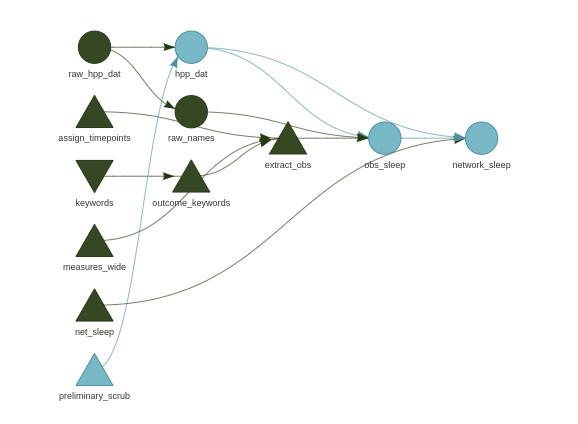

```{r setup, include=FALSE}
knitr::opts_chunk$set(
    echo = FALSE,
    message = FALSE)

# nb: to enable presenter mode add ?presentme=true to end of url
```


```{r }
# packages used
library(tidyverse) 
library(sysrevdata) 
library(gt)
library(glue)
library(knitr)

# for reproducbility
set.seed(40)

```

<style>
div.footnotes {
  position: absolute;
  bottom: 0;
  margin-bottom: 10px;
  width: 80%;
  font-size: 0.6em;
}
</style>


# failing | at good enough scientific practice in R 

## more failures than success {.smaller}

### For every $\varphi$ successes, there are $\theta$ failures. 

Proportion of success 

$$
\frac{\varphi}{\varphi + \theta}
$$

All trials

$$
\varphi + \theta
$$

We often think of science as a function of success

$$
\varphi \sim \text{Binomial}\left( \varphi + \theta,\, \frac{\varphi}{\varphi + \theta}\right)
$$

### today, let's talk about $\theta$


## standard structure | phd in statistical science

<center>
$\color{darkgreen}{\text{mathematics}}$ $\to$ 

code $\to$ 

paper $\to$ 

tool
</center>
<div class="notes">

### standard training

mathematics

### not in standard training

code, paper, tool

</div>

## {data-background=thesis-title-page.png data-background-position=right}

### failing at all the things 

*the nature of interdisciplinary research*

$\color{darkred}{\times}$ mathematics $\not\to$

$\color{darkred}{\times}$ code $\not\to$


$\color{darkred}{\times}$ paper $\not\to$


$\color{darkred}{\times}$ tool


<div class="notes">
### rescoping for success

- RSE-X research software engineering

- EB-X evidence-based decisions

</div> 

## Good enough scientific programming 


### 2014 
1. Wilson G, Aruliah DA, Brown CT, et al. [Best Practices for Scientific Computing](https://dx.plos.org/10.1371/journal.pbio.1001745). Eisen JA, ed. PLoS Biology. 2014;12(1):e1001745. doi:10.1371/journal.pbio.1001745

### 2017

2. Wilson G, Bryan J, Cranston K, Kitzes J, Nederbragt L, Teal TK. [Good enough practices in scientific computing](http://dx.plos.org/10.1371/journal.pcbi.1005510). Ouellette F, ed. PLOS Computational Biology. 2017;13(6):e1005510. doi:10.1371/journal.pcbi.1005510

<div class = "notes">
Term is also used in psychology

Good enough parenting
Good enough friend
</div>

## failing is the best we can do | at reproducible science

```{r fig.align='center', out.width="60%"}


```

<div class="notes">

If you failed, it means you tried. 

You'll never get everything right in computational science.

Trying is the best you can do. You will fail. You find useful workflows.
</div>

# reproducible scientific analysis in R

```{r}

talk_sections <-
tibble(
 sections_in_this_talk = c(   
"**.Rmd**-driven development",
"**functions**",
"**documentation** of functions",
"**git** and version control",
"**testing** and **workflow** of functions and data",
"reproducible **document** for publication"
)) 
```

```{r}
talk_sections 
```


## reproducible scientific analysis in R


```{r fig.align='right'}
talk_sections %>% 
    rename(sections = sections_in_this_talk) %>% 
    gt() %>% 
    fmt_markdown(columns=TRUE) 
 
```

### for each section

1. my fails
2. key resources
3. your fails

<div class="notes">
Why do we care about reproducibility? 

So we can validate our results. 

So others can extend.

We use multiple tools to achieve these aims, which we may refer to collectively as reproducible computing. 

Different techniques provide different solutions to diferent aspects of reproducible science. From accessibility of code, functions, to understanding functions' purpose. 

Examples of what each of the techniques solve.
</div>

## [CRAPL](http://matt.might.net/articles/crapl/) | the Community Research and Academic Programming License

<div class="notes">
This is the bit that really jumped out at me.

It is in this spirit that we shall investigate the various techniques of reproducibility. 
</div>

<div class = "columns-2">

An open source license for academics has additional needs: 

1. it should require that source and modifications used to validate scientific claims be released with those claims; and 
2. *more importantly*, it should absolve authors of shame, embarrassment and ridicule for ugly code. 

###  Recommended by [\@DrVeronikaCH](https://twitter.com/DrVeronikaCH)

<blockquote class="twitter-tweet"><p lang="en" dir="ltr">How I Fail S02E10: Charles T. Gray (PhD&#39;21, Interdisciplinary Computational Metascience) interview with <a href="https://twitter.com/cantabile?ref_src=twsrc%5Etfw">@cantabile</a> <a href="https://twitter.com/hashtag/AcademicTwitter?src=hash&amp;ref_src=twsrc%5Etfw">#AcademicTwitter</a> <a href="https://twitter.com/hashtag/CVofFailures?src=hash&amp;ref_src=twsrc%5Etfw">#CVofFailures</a> <a href="https://t.co/d7hbHMxSqX">https://t.co/d7hbHMxSqX</a></p>&mdash; Dr Veronika Cheplygina (@DrVeronikaCH) <a href="https://twitter.com/DrVeronikaCH/status/1366795610234499079?ref_src=twsrc%5Etfw">March 2, 2021</a></blockquote> <script async src="https://platform.twitter.com/widgets.js" charset="utf-8"></script> 

<\div>

# .Rmd-driven development

## failing at | .Rmd-driven development {.smaller}

<div class = "columns-2">

### before

[dumpsterfire.pdf](https://github.com/softloud/measureofcodeproof) 

```{r}


```


### after

[waystation paper](https://github.com/softloud/happypillpain/blob/master/manuscript/RSM/nmareporting.pdf)

</div>

<div class = "notes">

show files that make up the dumpsterfire

</div>

## .Rmd fails | resources

1. Grolemund YX JJ Allaire, Garrett. R Markdown: The Definitive Guide.; 2020. Accessed February 7, 2021. https://bookdown.org/yihui/rmarkdown/

2. Riederer E. RMarkdown Driven Development (RmdDD). Emily Riederer. Published May 4, 2019. Accessed January 30, 2020. https://emilyriederer.netlify.com/post/rmarkdown-driven-development/

3. Knitr with LaTeX. Accessed March 3, 2021. http://kbroman.org/knitr_knutshell/pages/latex.html


## .Rmd fails | tell me your stories {.smaller}


```{r fig.align='center'}


```


# git 


## failing at git

<div class = "notes">

show thesis, dumpsterfire repos search result on github

</div>

<div class="columns-2">

### working on your own

Set up with Happy Git to R

Create repository on GitHub

```{r out.height="300%"}

```

```{r eval=FALSE, echo=TRUE}
# pr helpers

pr_init(branch = "idea")

# make changes

# commit

pr_push()

# wait for merge

pr_finish()

```


</div>

## git fails | resources

1. Bryan J. Excuse Me, Do You Have a Moment to Talk About Version Control? The American Statistician. 2018;72(1):20-27. doi:10.1080/00031305.2017.1399928

2. various. Git - Reference.; 2021. Accessed February 7, 2021. https://git-scm.com/docs

3. various. GitHub CLI Manual.; 2021. Accessed February 7, 2021. https://cli.github.com/manual/index

4. Bryan J. Happy Git with R.; 2019. https://happygitwithr.com/resources.html

5. Pull request helpers • usethis. Accessed March 3, 2021. https://usethis.r-lib.org/articles/articles/pr-functions.html


## git fails | tell me your stories


```{r fig.align='center'}


```

# functions and documentation

## failing at writing functions and documentation

<div class = "notes">
discuss how the functions need to be structured around the things that will change in the analysis

not always the most obvious in terms of code, how to structure

where expert opinion is needed

</div>

### before

[`varameta::`](https://github.com/softloud/varameta/blob/master/vignettes/pinheiro.Rmd)

[`simeta::`](https://github.com/softloud/simeta)


### after 

[happypillpain](https://github.com/softloud/happypillpain)

## function & documentation fails | resources

- `vignette("rd")`

1. Wickham H. Advanced R. 1 edition. Routledge; 2014.

2. Wickham H. R Packages: Organize, Test, Document, and Share Your Code. O’Reilly Media; 2015. https://books.google.com.au/books?id=DqSxBwAAQBAJ


## function & documentation fails | tell me your stories


```{r fig.align='center', out.width="60%"}


```

# testing and workflow


## failing at testing and workflow


<div class="notes">
Discuss how the tests ended up becoming more work than the problems they fixed

Lost interest because testing was too onerous

Show visnetwork in happypill pain.
</div>p

<div class= "columns-2">
### before

[`simeta::` tests](https://github.com/softloud/simeta/tree/master/tests/testthat)

### after

```{r out.width="100%"}

```

</div>

## testing and workflow fails | resources

1. Landau W, Company CEL and. Chapter 2 Walkthrough | The Targets R Package User Manual. Accessed March 3, 2021. https://books.ropensci.org/targets

2. Wickham H. R Packages: Organize, Test, Document, and Share Your Code. O’Reilly Media; 2015. https://books.google.com.au/books?id=DqSxBwAAQBAJ


## testing and workflow fails | tell me your stories


```{r fig.align='center', out.width="60%"}


```

todo: get visnet & paper

# unexpected perks of failing

## code resurrection

<blockquote class="twitter-tweet"><p lang="en" dir="ltr">Installed one package and managed to run <a href="https://twitter.com/DrVeronikaCH?ref_src=twsrc%5Etfw">@DrVeronikaCH</a>&#39;s shiny app locally--- how often does that happen?!<br><br>Her first repo on GH, first R project, and it&#39;s from 5 years ago! <br><br>Installed one 📦then runApp() -- and it just works 😮<br><br>Heroic reproducibility! 🥐🥐🥐 <a href="https://t.co/JIOzfOejch">pic.twitter.com/JIOzfOejch</a></p>&mdash; Dr Charles T. Gray ⚔🦋 (@cantabile) <a href="https://twitter.com/cantabile/status/1364684273362423809?ref_src=twsrc%5Etfw">February 24, 2021</a></blockquote> <script async src="https://platform.twitter.com/widgets.js" charset="utf-8"></script> 

## failing is the best we can do | at reproducible science

<div class = "notes">
Expect the unexpected.
</div>

```{r fig.align='center', out.width="60%"}


```

If you failed, it means you tried. 

You'll never get everything right in computational science.

Trying is the best you can do. You will fail. You find useful workflows.


