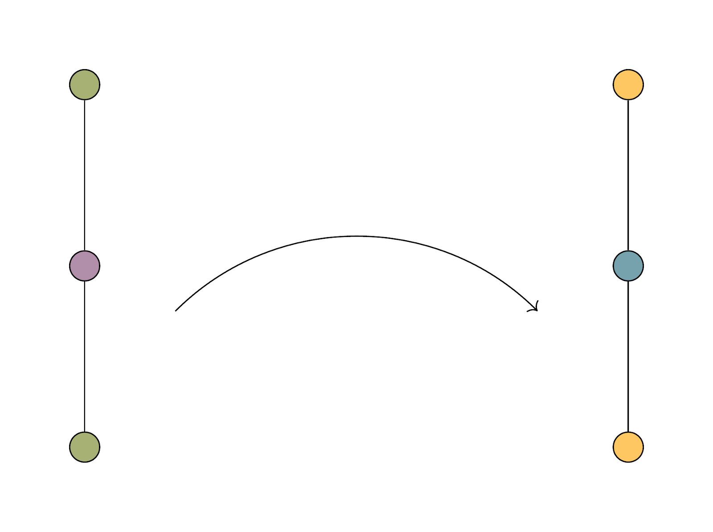

```{r setup, include=FALSE}
knitr::opts_chunk$set(echo = TRUE)
```

---

# "You type so fast it's scary."

---

# _Music prepared me for mathematics._

---

# Listening to music is doing algebra.

---

## Less than or equal to


# $\leqslant$


---

# Define $\leqslant$


Let $P$ be a set.

An *order* on $P$ is a binary relation $\leqslant$ on $P$ such that,

***

for all $x, y, z$ in $P$, we have

- $x \leqslant x$;
- $x \leqslant y$ and $y \leqslant x$ imply $x = y$;
- $x \leqslant y$ and $y \leqslant z$ imply $x \leqslant z$.

***

We then say $\leqslant$ is *reflexive*, *antisymmetric*, and *transitive*, for each of these properties, respectively.

---

# Definition: homomorphism

A *homomorphism* is a structure-preserving map.

> todo: mathematical definition


Order is one kind of structure we might preserve.

---



## Order-preserving homomorphism

---


## Order-reversing homomorphism

---

# Ostinato

---

# Ostinati & tessellation

A musical *ostinato* is a repeated musical pattern. 

- rhythmic ostinato
- melodic ostinato
- harmonic ostinato

A mathematical tessellation is a ... todo: definition of tessellation. 

We can compose by tessellating ostinati.


---

## Let's do some algebra

*Tessellations from Eppalock to Heidelberg* by Charles T. Gray

An original algorithmic piano composition created for the opening ceremony of the 2019 Heidelberg Laureate Forum.


